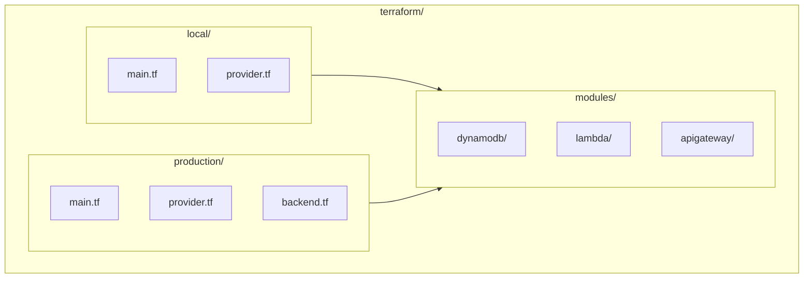
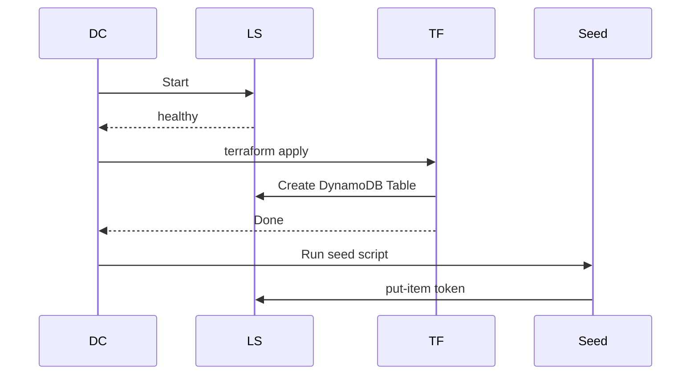

# Terraform 構成ガイド

## 概要

このプロジェクトでは、AWS リソース（DynamoDB、Lambda、API Gateway）を Terraform で管理します。
ローカル開発環境（LocalStack）と本番環境（AWS）を**ディレクトリ分離パターン**で管理し、共通のモジュールを再利用する構成です。

### 背景

従来は `init/00_dynamodb.sh` などのシェルスクリプトでリソースを作成していましたが、以下の理由から Terraform への移行を進めています：

| 観点 | シェルスクリプト | Terraform |
|------|-----------------|-----------|
| 冪等性 | 自前で実装必要 | 標準で対応 |
| 状態管理 | なし | あり |
| 変更の事前確認 | 困難 | `plan` で確認可能 |
| ロールバック | 手動 | 容易 |
| チーム協業 | 困難 | レビュー・承認フロー可能 |

## ディレクトリ構成

```
terraform/
├── modules/                    # 共通モジュール
│   ├── dynamodb/
│   │   ├── main.tf             # DynamoDB テーブル定義
│   │   ├── variables.tf        # 変数定義
│   │   └── outputs.tf          # 出力定義
│   ├── lambda/
│   │   ├── main.tf             # Lambda 関数、IAM Role/Policy 定義
│   │   ├── variables.tf        # 変数定義
│   │   └── outputs.tf          # 出力定義
│   └── apigateway/
│       ├── main.tf             # REST API、Authorizer、統合定義
│       ├── variables.tf        # 変数定義
│       └── outputs.tf          # 出力定義
├── local/                      # ローカル環境用（LocalStack）
│   ├── main.tf                 # モジュール呼び出し
│   ├── provider.tf             # LocalStack エンドポイント設定
│   └── versions.tf             # バージョン固定
└── production/                 # 本番環境用（AWS）
    ├── main.tf                 # モジュール呼び出し
    ├── provider.tf             # AWS 本番設定
    ├── backend.tf              # S3 リモートステート設定（雛形）
    └── versions.tf             # バージョン固定
```



## ファイル詳細

### 共通モジュール

**`terraform/modules/dynamodb/main.tf`**

- DynamoDB テーブル（AllowedTokens）のリソース定義
- 現在のシェルスクリプトと同等の設定（PAY_PER_REQUEST、hash_key: token）

**`terraform/modules/dynamodb/variables.tf`**

- テーブル名、タグなどの変数定義

**`terraform/modules/dynamodb/outputs.tf`**

- テーブル ARN、テーブル名の出力（Lambda 連携用）

**`terraform/modules/lambda/main.tf`**

- IAM Role（Lambda 実行用）の定義
- IAM Policy（DynamoDB GetItem/Query 権限）の定義
- Lambda 関数のリソース定義

**`terraform/modules/lambda/variables.tf`**

- 関数名、ランタイム、タイムアウトなどの変数定義
- zip ファイルパス、DynamoDB テーブル情報の変数定義

**`terraform/modules/lambda/outputs.tf`**

- 関数 ARN、Invoke ARN、ロール ARN の出力（API Gateway 連携用）

**`terraform/modules/apigateway/main.tf`**

- REST API の定義
- リソース（/test）の定義
- TOKEN タイプの Lambda Authorizer 定義
- GET メソッドと AWS_PROXY 統合の定義
- デプロイとステージの定義

**`terraform/modules/apigateway/variables.tf`**

- API 名、ステージ名、リージョンの変数定義
- Authorizer/バックエンド Lambda 関数の ARN 変数定義

**`terraform/modules/apigateway/outputs.tf`**

- API ID、実行 ARN、呼び出し URL の出力

### ローカル環境用

**`terraform/local/provider.tf`**

- LocalStack エンドポイント設定（http://localstack:4566）
- 認証スキップ設定

**`terraform/local/main.tf`**

- DynamoDB モジュールの呼び出し
- Lambda モジュールの呼び出し
- API Gateway モジュールの呼び出し

**`terraform/local/versions.tf`**

- Terraform/AWS プロバイダーのバージョン固定

### 本番環境用

**`terraform/production/provider.tf`**

- AWS 本番環境設定

**`terraform/production/main.tf`**

- DynamoDB モジュールの呼び出し
- Lambda モジュールの呼び出し
- API Gateway モジュールの呼び出し

**`terraform/production/backend.tf`**

- S3 リモートステート設定（コメントアウトで雛形提供）

**`terraform/production/versions.tf`**

- バージョン固定

### Docker 連携

`docker-compose.yml` に追加された Terraform サービス：

```yaml
terraform:
  image: hashicorp/terraform:latest
  depends_on:
    localstack:
      condition: service_healthy
  environment:
    - AWS_ACCESS_KEY_ID=${AWS_ACCESS_KEY_ID}
    - AWS_SECRET_ACCESS_KEY=${AWS_SECRET_ACCESS_KEY}
    - AWS_REGION=${AWS_REGION}
  volumes:
    - ./terraform:/terraform
    - ./lambda:/lambda:ro
  working_dir: /terraform/local
  entrypoint: ["/bin/sh", "-c"]
  command: ["terraform init && terraform apply -auto-approve"]
  networks:
    - local-gateway
```

### シードデータスクリプト

**`init/seed_dynamodb.sh`**（既存スクリプトから分離）

- token: "allow" の投入のみを担当
- Terraform 実行後に別途実行する形式

## 管理リソース

### DynamoDB

| テーブル名 | 主キー | 課金モード | 用途 |
|-----------|--------|-----------|------|
| AllowedTokens | token (String, HASH) | PAY_PER_REQUEST | Lambda Authorizer の許可トークン格納 |

### Lambda

| 関数名 | ランタイム | ハンドラー | 用途 |
|--------|-----------|-----------|------|
| authz-go | provided.al2023 | bootstrap | API Gateway の Lambda Authorizer |

### IAM

| リソース名 | タイプ | 用途 |
|-----------|--------|------|
| lambda-authorizer-role | IAM Role | Lambda Authorizer 実行用ロール |
| lambda-authorizer-policy | IAM Policy | DynamoDB GetItem/Query 権限 |
| lambda-test-function-role | IAM Role | テスト用 Lambda 実行ロール |

### API Gateway

| リソース名 | タイプ | 用途 |
|-----------|--------|------|
| local-gateway-api | REST API | メイン API |
| /test | リソース | テストエンドポイント |
| token-authorizer | Authorizer | TOKEN タイプの Lambda Authorizer |
| test | ステージ | デプロイステージ |

## ローカル環境での使い方

### 方法1: docker compose を使う（推奨）

```bash
# Terraform で DynamoDB テーブルを作成
docker compose up terraform

# シードデータを投入
docker compose run awscli /init/seed_dynamodb.sh
```

### 方法2: 手動で実行

```bash
# Terraform コンテナに入る
docker compose run --rm terraform sh

# 初期化と適用
cd /terraform/local
terraform init
terraform plan
terraform apply
```

### 実行フロー



## 本番環境での使い方

### 事前準備

1. **S3 バケットの作成**（tfstate 保存用）
2. **DynamoDB テーブルの作成**（ロック用）
3. **`terraform/production/backend.tf`** のコメントを解除

```hcl
# backend.tf のコメントを解除
terraform {
  backend "s3" {
    bucket         = "your-terraform-state-bucket"
    key            = "production/terraform.tfstate"
    region         = "ap-northeast-1"
    dynamodb_table = "terraform-locks"
    encrypt        = true
  }
}
```

### 実行

```bash
cd terraform/production

# 認証設定（いずれかの方法）
export AWS_ACCESS_KEY_ID=xxxxx
export AWS_SECRET_ACCESS_KEY=xxxxx
# または AWS CLI のプロファイルを使用
export AWS_PROFILE=your-profile

# 初期化
terraform init

# 変更内容の確認
terraform plan

# 適用
terraform apply
```

## シードデータ

シードデータ（初期データ）は Terraform とは別に管理しています。

### ローカル環境

```bash
docker compose run awscli /init/seed_dynamodb.sh
```

### 本番環境

```bash
aws dynamodb put-item \
  --table-name AllowedTokens \
  --item '{"token":{"S":"your-production-token"}}'
```

> **注意**: 本番環境のトークンはセキュリティ上の理由から、Terraform で管理せず別途投入してください。

## 既存スクリプトとの共存

Terraform への移行状況：

| リソース | 移行状況 | 説明 |
|---------|---------|------|
| DynamoDB テーブル | 完了 | `terraform/modules/dynamodb/` |
| Lambda 関数 | 完了 | `terraform/modules/lambda/` |
| API Gateway | 完了 | `terraform/modules/apigateway/` |

シードデータは Terraform とは別に `init/seed_dynamodb.sh` で管理しています。

## 将来の拡張

現在実装済みのモジュール：

```
terraform/modules/
├── dynamodb/          # 実装済み
├── lambda/            # 実装済み
└── apigateway/        # 実装済み
```

## トラブルシューティング

### terraform init でエラーが出る

```bash
# キャッシュをクリア
rm -rf .terraform .terraform.lock.hcl
terraform init
```

### LocalStack に接続できない

- `docker compose ps` で LocalStack が起動しているか確認
- ネットワークが `local-gateway` に参加しているか確認

### 状態ファイルのロック解除

```bash
terraform force-unlock <LOCK_ID>
```

## 参考リンク

- [Terraform AWS Provider](https://registry.terraform.io/providers/hashicorp/aws/latest/docs)
- [LocalStack](https://localstack.cloud/)
- [Terraform Best Practices](https://www.terraform-best-practices.com/)

